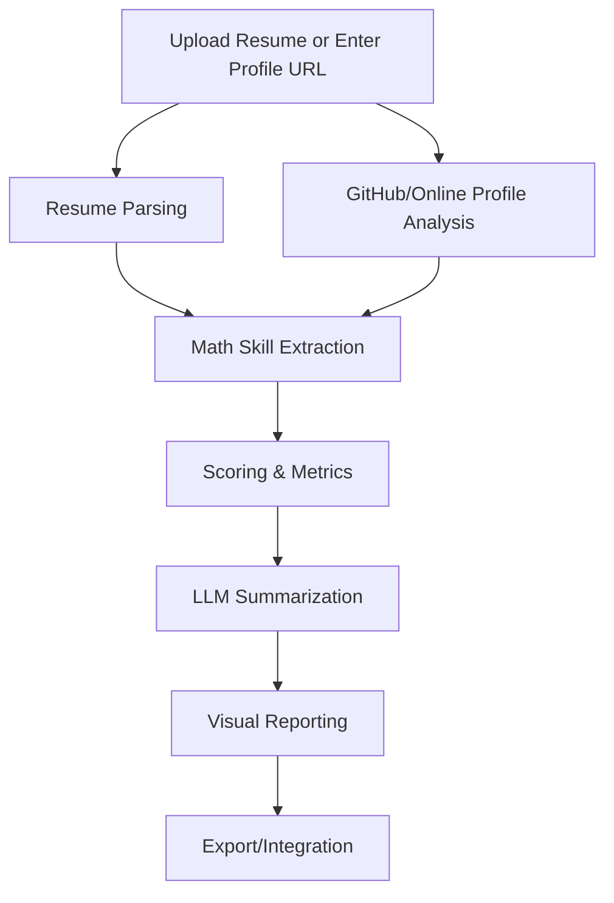

# Mathematical Talent Analyzer

A tool for technical recruiters to analyze resumes and online profiles (e.g., GitHub) for mathematical and technical strengths, generating recruiter-friendly summaries and talking points.

## Features
- Resume parsing (PDF/DOCX/text) using pypdf
- Analyze GitHub repositories for mathematical sophistication and technical skills
- Detect common math/science libraries (numpy, scipy, etc.) with robust false-positive avoidance (e.g., generic 'math' is excluded)
- Assess code complexity and algorithm usage (now includes 'theory' and uses precise word-boundary matching)
- Fetch and analyze documentation quality
- All analyzers are comprehensively tested, including edge and adversarial cases (see /tests/test_github_analyzer.py)
- Mathematical skill extraction and scoring
- LLM-powered summary and talking points
- Visual skill radar and reporting

## Quickstart

1. Clone the repo
2. Install dependencies:  
   `pip install -r requirements.txt`  (now uses `pypdf` for PDF parsing)
3. Run the app:  
   `streamlit run app.py` (or `python main.py`)

## Usage

- Upload resumes or enter profile URLs
- Review generated analysis and summaries
- Export reports or integrate with ATS

## Sample Resume Setup

To develop and test the resume parser, place sample PDF resumes in the following directory:

```
sample_resumes/
```

Each file should be named using the convention:

```
FirstName_LastName_Resume.pdf
```

Example:
```
sample_resumes/Ada_Lovelace_Resume.pdf
sample_resumes/Isaac_Newton_Resume.pdf
```

These files will be used for parser development, batch processing, and automated tests.

## Workflow Visualization

Below is a step-by-step workflow of how the Mathematical Talent Analyzer operates for a recruiter:

1. **Candidate Intake**
   - Upload resume (PDF/DOCX/text) or provide LinkedIn/GitHub URL.
2. **Automated Analysis**
   - Resume parsing: Extracts education, experience, projects, publications, and skills.
   - GitHub analysis: Fetches repositories and analyzes code for mathematical/algorithmic content using custom metrics.
   - Skill extraction: Identifies mathematical concepts, libraries, and algorithms.
   - Scoring: Assigns scores for mathematical depth, breadth, and recency.
3. **Summarization & Talking Points**
   - LLM generates recruiter-friendly summary, key takeaways, and suggested interview questions.
4. **Visual Reporting**
   - Visualizations (e.g., skill radar, metric scores, comparison charts) help recruiters quickly assess strengths.
5. **Export & Integration**
   - Download or copy summary reports; optionally integrate with ATS/CRM.

### Workflow Diagram



This workflow ensures that recruiters can efficiently analyze and summarize technical/mathematical talent, with clear visual and actionable outputs.

## Demo Highlights

### Key Features to Highlight
- **Code Inspection Tool:**
  - Click "View Code" on a high-scoring repository to inspect candidate code.
- **Mathematical Code Highlighting:**
  - Windsurf highlights mathematically sophisticated code sections automatically.
- **Scoring Algorithms Display:**
  - Access via Settings → GitHub Analysis → Scoring Algorithms to see how scores are computed.
- **Statistical Distribution View:**
  - Compare candidate scores against industry benchmarks with dynamic charts.

### Narration Points for Demo
- "What we're doing here is going beyond basic code quality metrics to specifically identify mathematical elegance."
- "This algorithm detects when someone implements an O(n log n) solution where most would use an O(n²) approach."
- "Notice how the system identified this elegant application of differential geometry in what appears to be a standard machine learning project."

## License
MIT
